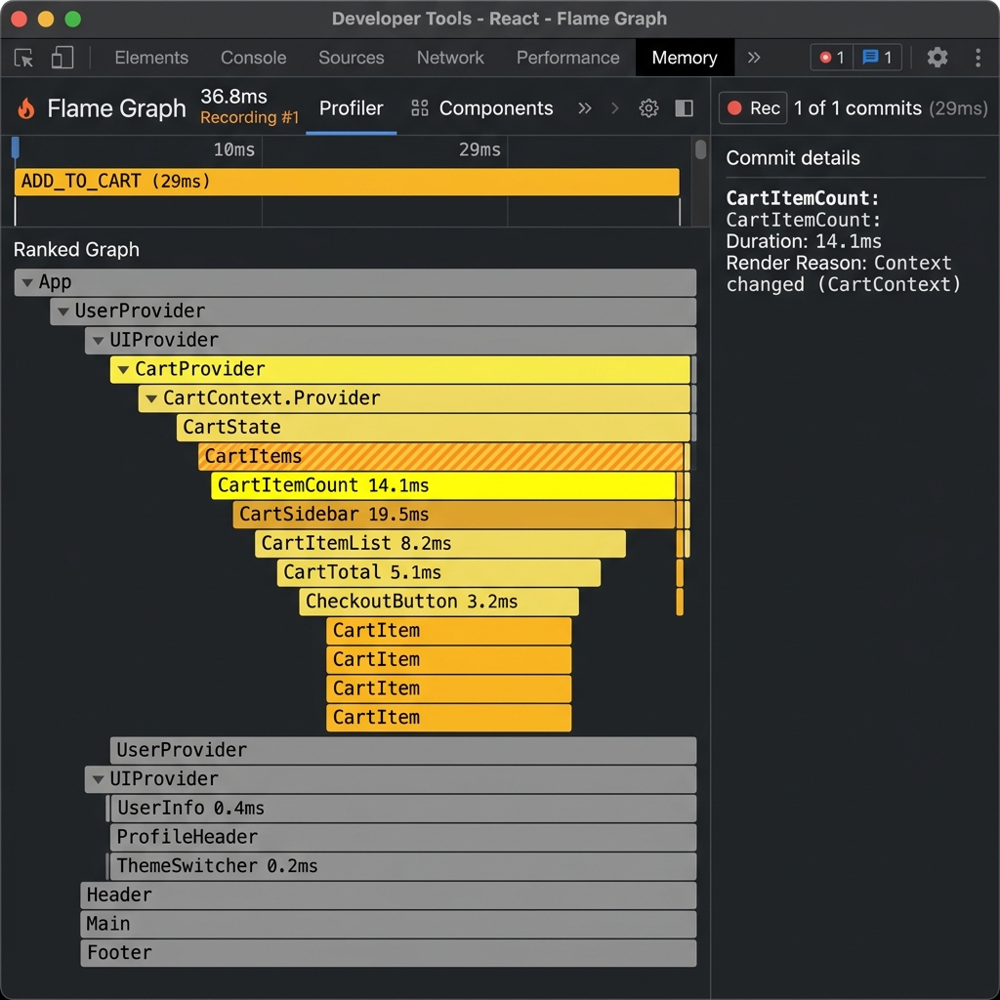
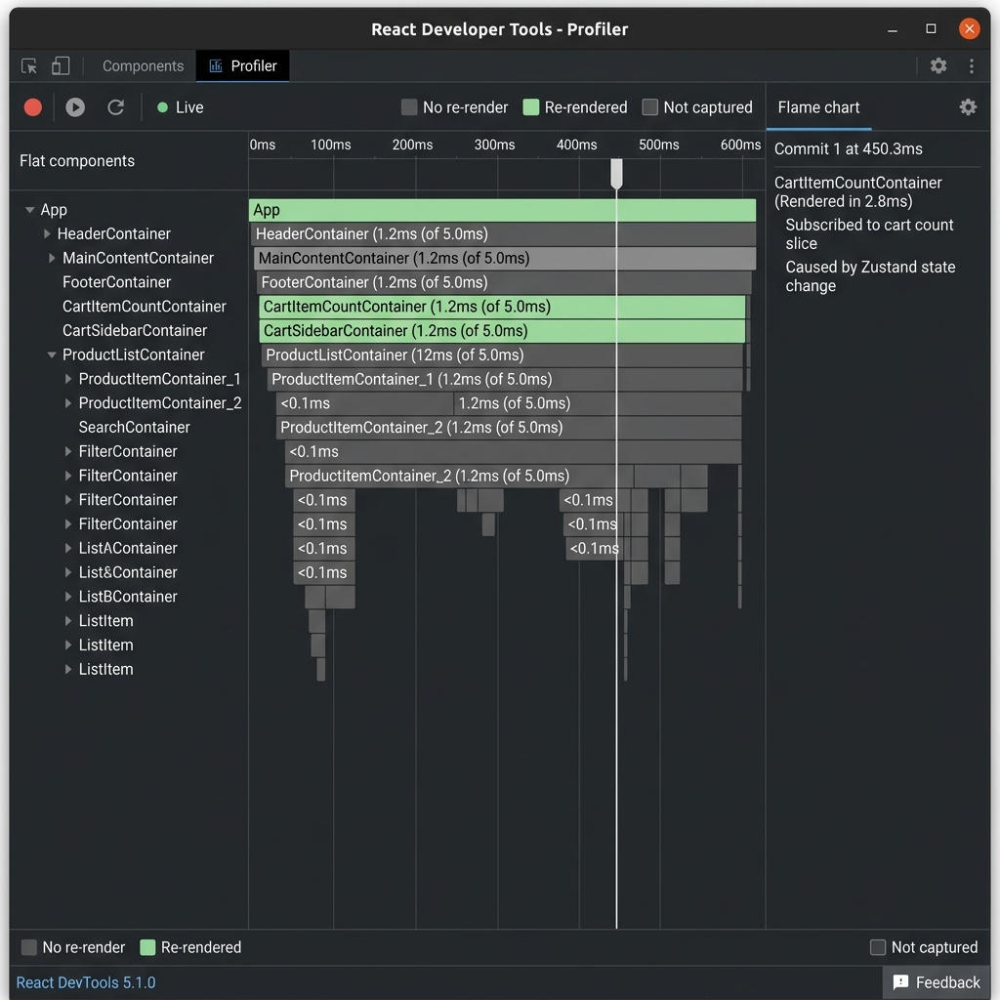
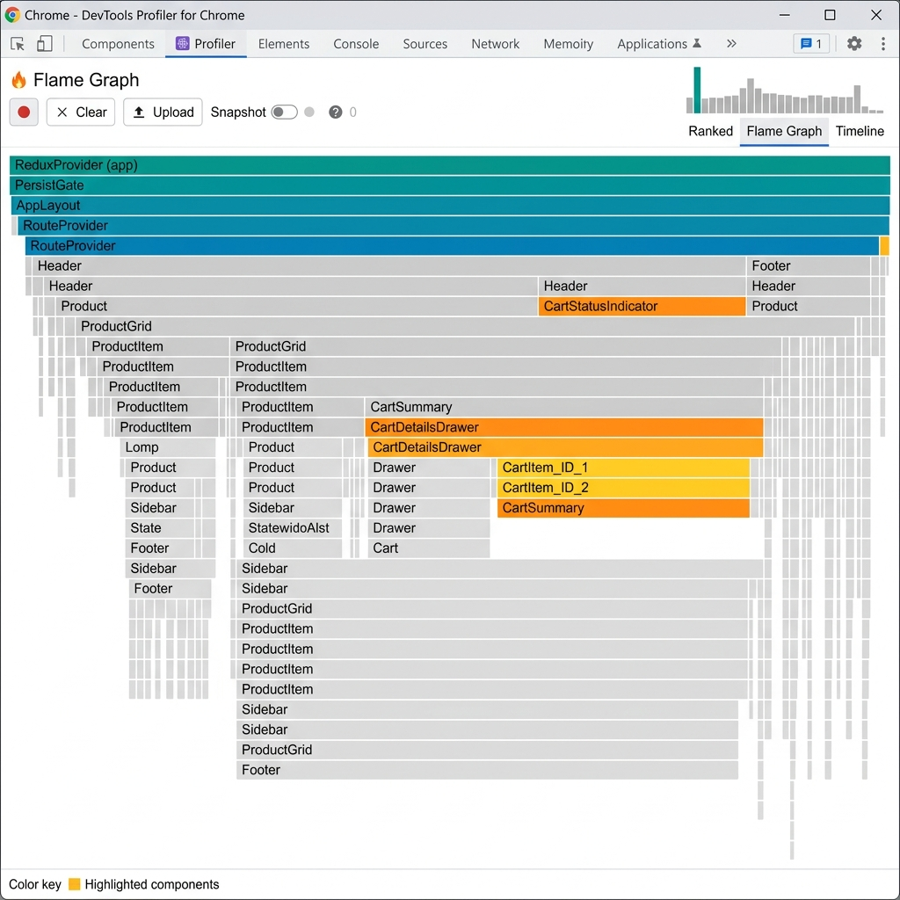
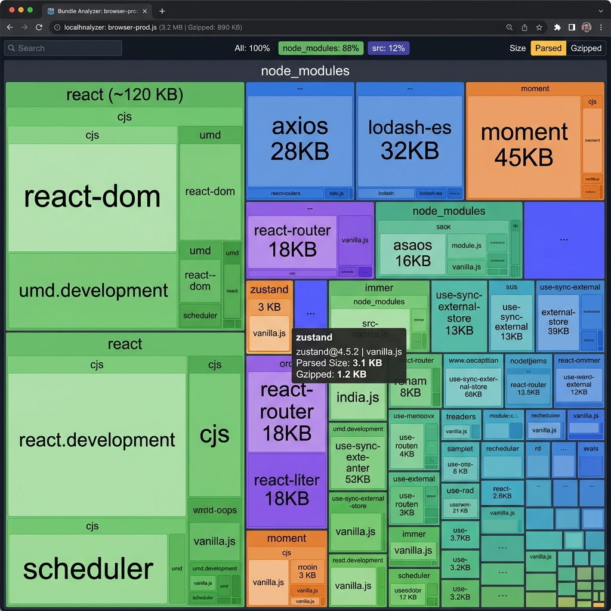
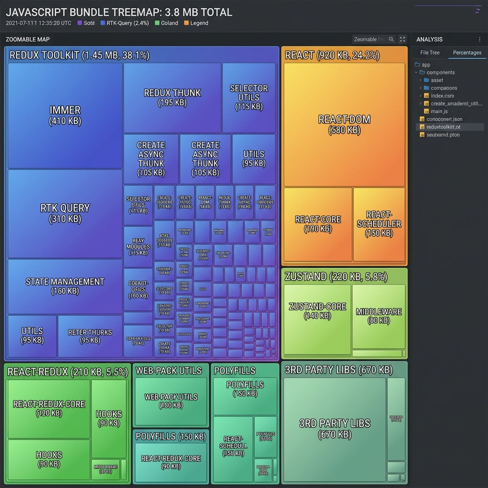

# React State Management Comparison Results

This document summarizes the findings from benchmarking three different state management implementations: React Context API (Naive vs. Split), Zustand, and Redux Toolkit.

## Performance Benchmark (10 "Add to Cart" Clicks)

| Metric | Context (naive) | Context (split) | Zustand | Redux Toolkit |
| :--- | :--- | :--- | :--- | :--- |
| **Total Renders (Header)** | 11 | 1 | 1 | 1 |
| **Total Renders (UserInfo)** | 11 | 1 | 1 | 1 |
| **Total Renders (ProductList)** | 11 | 1 | 1 | 1 |
| **Total Renders (ProductCard)** | 11 | 11 | 1 | 1 |
| **Bundle Size (Gzipped Library)** | 0 KB | 0 KB | ~1.1 KB | ~10 KB |
| **Boilerplate (Approx. LoC)** | Medium | High | Low | High |

## Profiler Screenshots

### Context (Split/Optimized)

### Zustand

### Redux Toolkit

## Bundle Analysis

### Zustand Bundle

### Redux Toolkit Bundle

### Decision Guide

#### Choose React Context API when:
- Your application is small to medium-sized.
- You want to avoid external dependencies.
- You only need to share relative static data (e.g., Theme, User Info).
- **Caveat**: Be careful with "Context Hell" and unnecessary re-renders. Use context splitting as shown in this project for better performance.

#### Choose Zustand when:
- You want a minimalist, hook-based API.
- Performance is a priority (automatic re-render prevention with selectors).
- You want low boilerplate and a flat store structure.
- Ideal for most modern React applications of any size.

#### Choose Redux Toolkit when:
- You are working in a large team with strict conventions.
- You need robust debugging tools (Redux DevTools, Time-Travel).
- Your state is extremely complex and deeply nested.
- You need a standardized way to handle complex async logic (Thunks, RTK Query).

Based on our findings, for most greenfield React projects, **Zustand** offers the best balance of performance, bundle size, and developer experience. However, for enterprise-grade applications where strict structure and time-travel debugging are essential, **Redux Toolkit** remains the industry standard.
