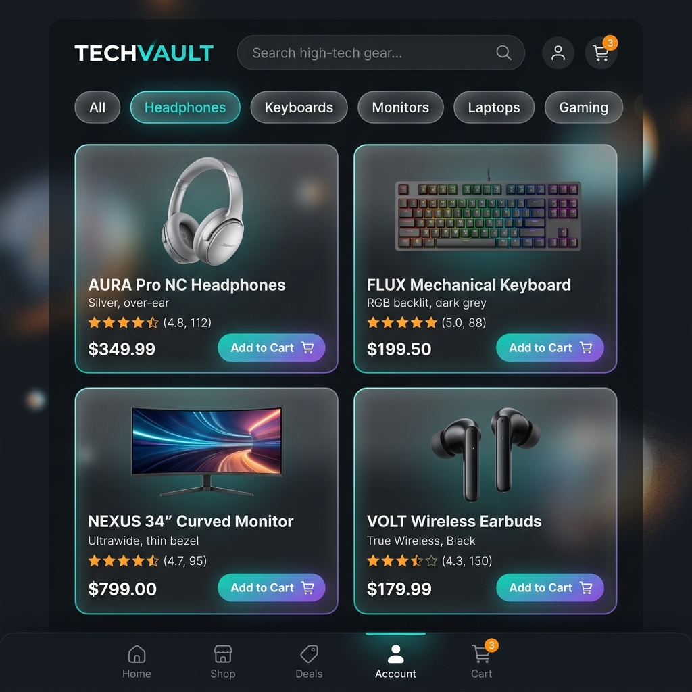

# Project Walkthrough: React State Management Comparison



This project provides a detailed comparison of three major state management architectures in React: **Context API**, **Zustand**, and **Redux Toolkit**.

## 📁 Repository Structure

-   **/context-version**: Naive implementation with a single global context.
-   **/context-split-version**: Optimized Context implementation using granular providers.
-   **/zustand-version**: Minimalist, hook-based state management with selectors.
-   **/redux-version**: Scalable, industry-standard implementation using Redux Toolkit (RTK).

## 🚀 Key Features

-   **Render Counting**: Every version tracks re-renders in real-time using a custom `RenderCount` badge.
-   **Premium UI**: Glassmorphism design, smooth transitions, and a modern product catalog.
-   **Standardized Benchmarking**: A fair comparison using the same component tree and 10-click "Add to Cart" protocol.

## 📊 Quick Results Summary

| Implementation | Re-renders (Header) | DX / Boilerplate | Best For |
| :--- | :--- | :--- | :--- |
| **Context (Naive)** | 11 | Low | Small demos only |
| **Context (Split)** | 1 | High | Medium apps, no deps |
| **Zustand** | 1 | Very Low | Modern, agile teams |
| **Redux Toolkit** | 1 | Medium/High | Large-scale enterprise |

## 🛠️ How to Run Locally

1.  Choose a version directory (e.g., `cd zustand-version`).
2.  Install dependencies: `npm install`.
3.  Start dev server: `npm run dev`.

## 🐳 Docker Deployment

To see the production-ready Redux version in a container:
```bash
docker-compose up --build
```
Access the app at `http://localhost:8080`.
